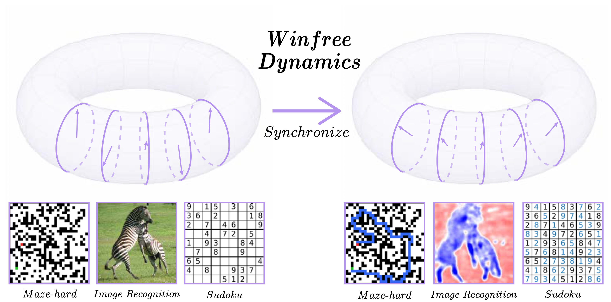

<h1 align="center">
  Winfree Oscillatory Neural Network (WONN)
</h1>

</p>

<p align="center">
  
</p>

<p align="center">
  <b>WONN</b> evolves neural representations on a toroidal phase space and applies generalized Winfree synchronization dynamics.
</p>


<hr>


We introduced the $Winfree$ $Oscillatory$ $Neural$ $Network$ (WONN), a neural architecture built upon generalized Winfree synchronization dynamics. Unlike conventional architectures that primarily rely on static feature transformations, WONN performs computation through the collective evolution and synchronization of phase oscillators on a toroidal state space $(S^1)^d$. 

By combining flexible interaction parameterizations, hierarchical grouped synchronization dynamics, and a dual phase--frequency state design, WONN provides a scalable framework for oscillatory neural computation.

The codebase currently includes experiments for:

- **Image recognition**: CIFAR-10, CIFAR-100, ImageNet-100, ImageNet-1K
- **Maze-Hard pathfinding**: 30×30 maze path prediction with energy-voting evaluation
- **Sudoku reasoning**: 9×9 Sudoku solving with recurrent Winfree dynamics

The main model idea is to evolve phase-valued hidden states through discretized Winfree oscillatory dynamics. Each layer runs several recurrent dynamics steps, followed by task-specific readout or layer transition modules.

## Repository structure

```text
WONN/
├── common/
│   ├── modules.py          # shared modules: attention, phase embedding, reshaping
│   ├── train_utils.py      # DDP setup, checkpointing, resume/finetune utilities
│   └── utils.py            # seeds, argparse helpers, state-dict loading helpers
│
├── image_recognition/
│   ├── wlayer.py           # Winfree layer for image recognition
│   ├── wnet.py             # WONN image-classification model
│   ├── cifar/
│   │   ├── train.py
│   │   ├── data.py
│   │   ├── run_cifar_ch128.sh
│   │   ├── run_cifar_ch256.sh
│   │   └── run_cifar_ch64to256.sh
│   └── imagenet/
│       ├── train_imagenet100.py
│       ├── train_imagenet1k.py
│       ├── data.py
│       ├── run_imagenet100_ch128.sh
│       ├── run_imagenet100_ch256.sh
│       ├── run_imagenet100_ch64to256.sh
│       ├── run_imagenet1k_ch256.sh
│       ├── run_imagenet1k_ch64to256.sh
│       └── run_imagenet1k_resume.sh
│
├── maze/
│   ├── train.py
│   ├── eval_maze.py
│   ├── data.py
│   ├── wlayer.py
│   ├── wnet.py
│   ├── run_train_maze.sh
│   └── run_eval_maze.sh
│
└── sudoku/
    ├── train.py
    ├── data.py
    ├── wlayer.py
    ├── wnet.py
    └── run_sudoku.sh
```

## Installation

A recent Linux environment with CUDA-capable GPUs is recommended. The code uses PyTorch, torchvision, torch distributed training, optional `torch.compile`, EMA tracking, TensorBoard logging, and optional Weights & Biases logging.

```bash
git clone <YOUR_REPO_URL>.git
cd WONN

conda create -n wonn python=3.10 -y
conda activate wonn

pip install -r requirements.txt
```

For GPU training, make sure the installed PyTorch build matches your CUDA driver/runtime. If needed, install the CUDA-specific PyTorch wheel first from the official PyTorch installation selector, then install the remaining dependencies from `requirements.txt`.

## Data format

### CIFAR-10 / CIFAR-100

Set `DATA_ROOT` to the directory containing the torchvision CIFAR files.

```bash
DATA_ROOT=/path/to/cifar GPUS=0 bash image_recognition/cifar/run_cifar_ch256.sh
```

By default, the CIFAR scripts use CIFAR-10. Override `DATA=cifar100` for CIFAR-100:

```bash
DATA=cifar100 DATA_ROOT=/path/to/cifar GPUS=0 bash image_recognition/cifar/run_cifar_ch256.sh
```

### ImageNet-100 / ImageNet-1K

The ImageNet-style datasets should follow the standard `ImageFolder` structure:

```text
/path/to/imagenet_root/
├── train/
│   ├── class_000/
│   ├── class_001/
│   └── ...
└── val/
    ├── class_000/
    ├── class_001/
    └── ...
```

For ImageNet-100, the code expects 100 classes. For ImageNet-1K, it expects 1000 classes.

### Maze-Hard

The Maze-Hard dataset root should contain:

```text
/path/to/maze-30x30-hard-1k/
├── train/
│   ├── all__inputs.npy
│   └── all__labels.npy
└── test/
    ├── all__inputs.npy
    └── all__labels.npy
```

The arrays are expected to have shape `[N, 900]`, corresponding to flattened 30×30 boards.

### Sudoku

The Sudoku dataset root should contain:

```text
/path/to/sudoku/
├── features.pt
└── labels.pt
```

Both tensors should have shape `[N, 9, 9, 9]`. The loader uses the first 9000 boards for training and the next 1000 boards for evaluation.

Implementation convention:

- input token `0` means blank/empty cell;
- input tokens `1`–`9` mean Sudoku digits `1`–`9`;
- cross-entropy targets are `0`–`8`, corresponding to solution digits `1`–`9`.

## Running experiments

All provided shell scripts set `PYTHONPATH` automatically and can be launched from the repository root. Most hyperparameters can be overridden through environment variables.

### CIFAR

```bash
DATA=cifar10 DATA_ROOT=/path/to/cifar GPUS=0 bash image_recognition/cifar/run_cifar_ch256.sh
```

Multi-GPU DDP example:

```bash
DATA=cifar100 \
DATA_ROOT=/path/to/cifar \
GPUS=0,1,2,3 \
NPROC=4 \
bash image_recognition/cifar/run_cifar_ch256.sh
```

Available CIFAR presets:

```bash
bash image_recognition/cifar/run_cifar_ch128.sh
bash image_recognition/cifar/run_cifar_ch256.sh
bash image_recognition/cifar/run_cifar_ch64to256.sh
```

### ImageNet-100

```bash
DATA_ROOT=/path/to/imagenet-100 \
GPUS=0 \
bash image_recognition/imagenet/run_imagenet100_ch256.sh
```

Available ImageNet-100 presets:

```bash
bash image_recognition/imagenet/run_imagenet100_ch128.sh
bash image_recognition/imagenet/run_imagenet100_ch256.sh
bash image_recognition/imagenet/run_imagenet100_ch64to256.sh
```

### ImageNet-1K

Single-node 4-GPU example:

```bash
DATA_ROOT=/path/to/imagenet-1k \
GPUS=0,1,2,3 \
NPROC=4 \
bash image_recognition/imagenet/run_imagenet1k_ch256.sh
```

Available ImageNet-1K presets:

```bash
bash image_recognition/imagenet/run_imagenet1k_ch256.sh
bash image_recognition/imagenet/run_imagenet1k_ch64to256.sh
```

Strict resume after interruption:

```bash
DATA_ROOT=/path/to/imagenet-1k \
GPUS=0,1,2,3 \
NPROC=4 \
PRESET=ch256 \
EXP_NAME=WONN_imagenet1k_attn_mlp_ch256 \
RESUME=runs/WONN_imagenet1k_attn_mlp_ch256/checkpoint_latest.pth \
bash image_recognition/imagenet/run_imagenet1k_resume.sh
```

When using strict resume, keep the model architecture, data path, batch size, optimizer, scheduler, AMP, compile, and DDP settings consistent with the original run.

### Maze-Hard training

```bash
DATA_ROOT=/path/to/maze-30x30-hard-1k \
GPUS=0 \
bash maze/run_train_maze.sh
```

Example override:

```bash
DATA_ROOT=/path/to/maze-30x30-hard-1k \
GPUS=0 \
T=24 \
CH=256 \
BS=100 \
EXP_NAME=maze_L1T24_g1_ch256_bs100 \
bash maze/run_train_maze.sh
```

### Maze-Hard evaluation with energy voting

```bash
DATA_ROOT=/path/to/maze-30x30-hard-1k \
MODEL_PATH=runs/maze/maze_L1T24_g1_ch128_e9000_lr1e3_b0995_s137/ema_model.pth \
GPUS=0 \
bash maze/run_eval_maze.sh
```

The default evaluation script uses 32 random initializations and reports energy-voting metrics based on final-step energy and path-sum energy.

### Sudoku

```bash
DATA_ROOT=/path/to/sudoku \
GPUS=0 \
bash sudoku/run_sudoku.sh
```

Multi-GPU DDP example:

```bash
DATA_ROOT=/path/to/sudoku \
GPUS=0,1,2,3 \
NPROC=4 \
bash sudoku/run_sudoku.sh
```

## Outputs and checkpoints

Training outputs are saved under `runs/` by default.

Typical saved files include:

```text
runs/<exp_name>/
├── train.txt
├── checkpoint_*.pth
├── checkpoint_latest.pth
├── ema_*.pth
├── ema_latest.pth
├── model.pth
└── ema_model.pth
```

For Maze and Sudoku, the default save roots are:

```text
runs/maze/<exp_name>/
runs/sudoku/<exp_name>/
```

`checkpoint_*.pth` files are intended for training resume. `model.pth` and `ema_model.pth` are final model weights for evaluation or downstream use.

## Common options

Most scripts expose the following environment-variable overrides:

```bash
GPUS=0,1,2,3        # visible CUDA devices
NPROC=4             # number of DDP processes
DATA_ROOT=/path     # dataset root
EXP_NAME=name       # run name
EPOCHS=300          # number of epochs
BS=128              # training batch size per process
EVAL_BS=128         # evaluation batch size per process
LR=7.5e-4           # learning rate
SEED=137            # random seed
AMP=True            # mixed precision switch
AMP_DTYPE=bf16      # bf16 or fp16
COMPILE=True        # torch.compile switch
```

Image-recognition scripts also support:

```bash
COUPLING=attn       # attn or conv
SI_FUNC=mlp         # mlp or trig
```

## Notes

- The main image-recognition settings use `L=6`, `T=3`, grouped Winfree dynamics with `group_size=2`, and attentive coupling by default.
- Maze-Hard and Sudoku currently use attentive coupling in the provided scripts.
- `torch.compile=True` can improve performance on recent PyTorch/CUDA stacks, but it may require additional compile time and may be sensitive to local environment details.
- For reproducibility, always record the full command, dataset version, GPU count, PyTorch/CUDA version, and checkpoint path.

